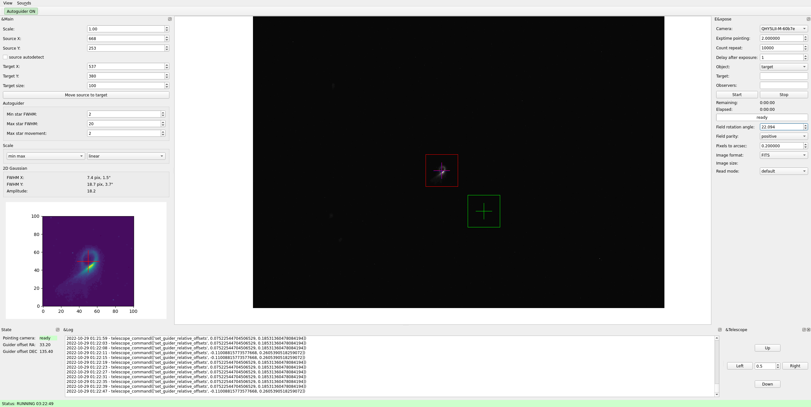
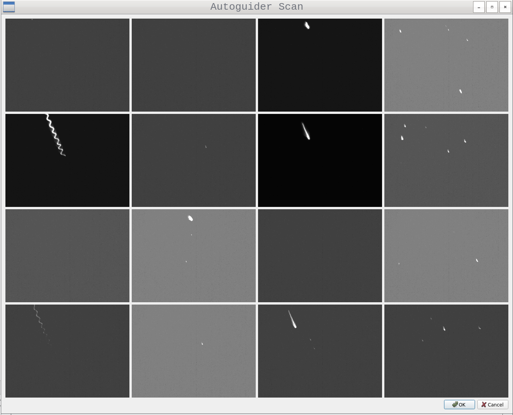
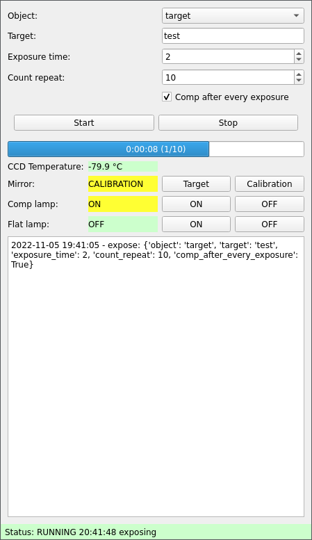
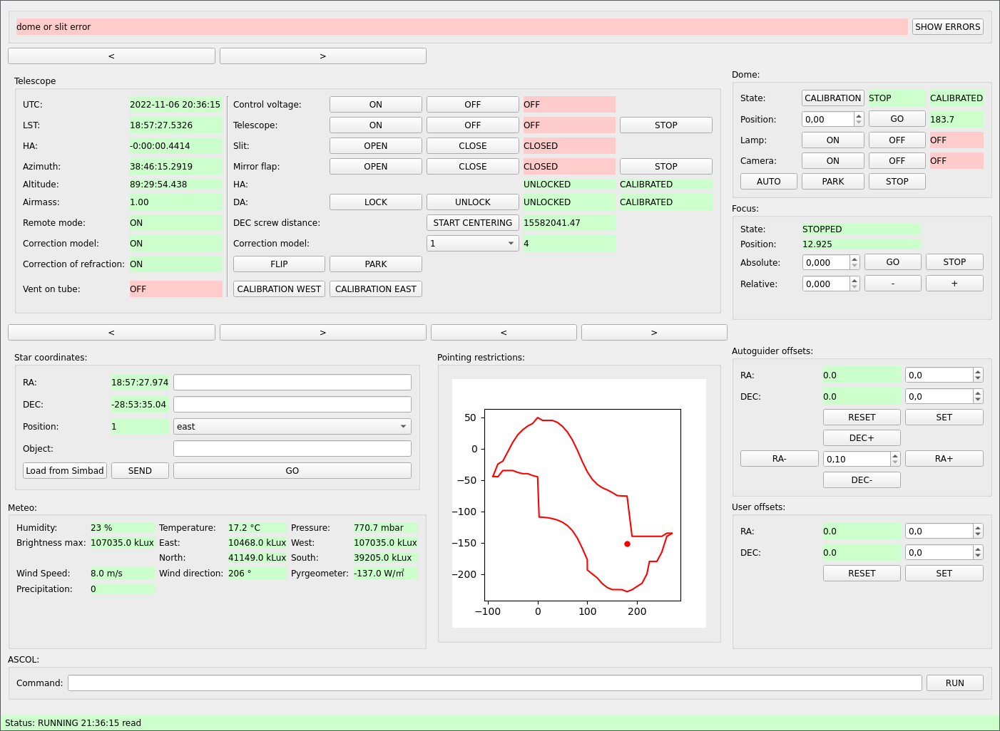
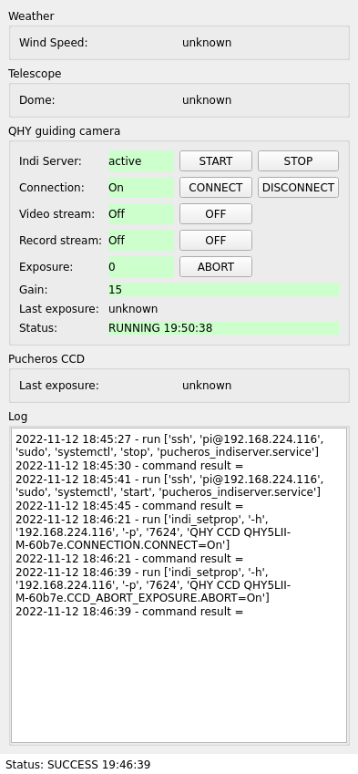

# platospec
Ground-based support for exoplanetary space missions.

```
workstation$ git clone https://github.com/jan-fuchs-fuky/platospec.git platospec
```

All programs directory must be copy to /opt.

All programs log directory must be writable for normal user.

Create following directories and this directories must be writable for normal user:

```
$ mkdir -p /data/pucheros_guiding/
$ mkdir -p /data/pucheros_guiding/INCOMING/
$ mkdir -p /data/pucheros_sci/
```

## Dependencies

Download INDI Core Library from https://github.com/indilib/indi and install:

```
# apt install git cdbs dkms cmake fxload libev-dev libgps-dev libgsl-dev libraw-dev \
libusb-dev zlib1g-dev libftdi-dev libgsl0-dev libjpeg-dev libkrb5-dev libnova-dev \
libtiff-dev libfftw3-dev librtlsdr-dev libcfitsio-dev libgphoto2-dev build-essential \
libusb-1.0-0-dev libdc1394-22-dev libboost-regex-dev libcurl4-gnutls-dev libtheora-dev \
libnova-dev libfftw3-dev swig

$ unzip indi-master.zip
$ mkdir libindi_build
$ cd libindi_build
$ cmake -DCMAKE_INSTALL_PREFIX=/usr . ../indi-master
$ make
# make install
```

Download pyindi-client from https://github.com/indilib/pyindi-client and install:

```
# python3 setup.py install
```

Install:

```
# apt install libpython3.9-minimal python3-astroplan python3-astropy python3-astroquery \
libpython3.9-stdlib python3-opencv python3-dbus python3-humanize python3-zeroc-ice \
python3-matplotlib python3-numpy python3-pexpect python3-photutils python3-pyqt5 \
python3-requests python3-sdnotify python3-skimage python3-socketio rsync saods9 \
xpa-tools
```

## Pucheros Autoguider GUI

### Run

```
workstation$ /opt/indi_autoguider/bin/indi_autoguider.py
```




## Pucheros Expose GUI

### Run

```
workstation$ /opt/pucheros_expose_gui/bin/pucheros_expose.py
```



## Telescope Control GUI

### Run

Create wrapper **telescope_control_gui**:

```
#!/bin/bash

export ICE_CONFIG=/opt/telescope_control_gui/etc/ice_client.cfg

/opt/telescope_control_gui/bin/ascol_client.py

```

Add execute permission and run:

```
workstation$ chmod +x telescope_control_gui
workstation$ ./telescope_control_gui
```



## E152 Watchdog GUI

### Run

```
workstation$ /opt/e152_watchdog/bin/e152_watchdog.py
```



## Usage ASCOL simulator

Set paths **IceSSL.CAs** and **IceSSL.CertFile** in **etc/ice\_client.cfg** and **etc/ice\_server.cfg**.
Certificates and keys for testing purpose are in directory **ssl**.

```
$ cd platospec/telescope/
$ ./test/ascol_simulator.py
$ ICE_CONFIG=/home/user/git/platospec/telescope/etc/ice_server.cfg ./bin/ascol_server.py
$ ICE_CONFIG=/home/user/git/platospec/telescope/etc/ice_client.cfg ./bin/ascol_client_cli.py
```
