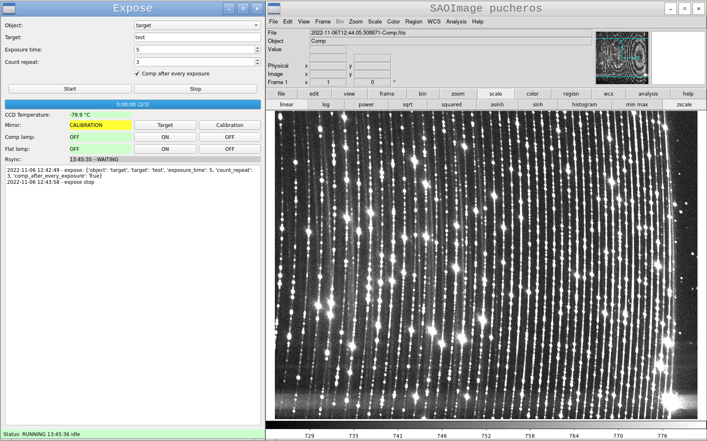
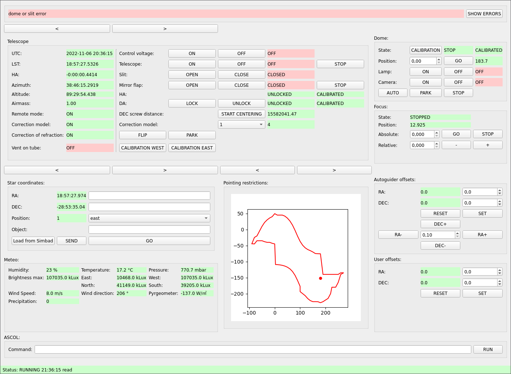
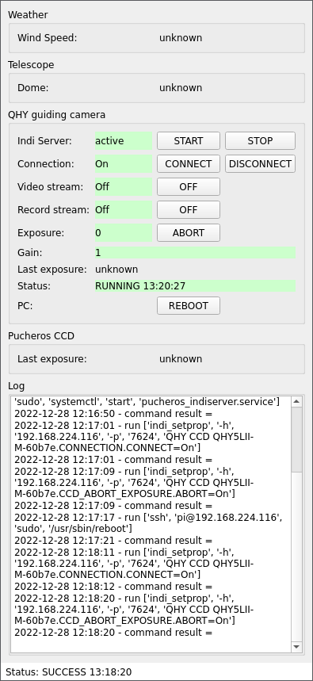

# platospec
Ground-based support for exoplanetary space missions.

### Table of Contents
- **[Ubuntu 22.04.1 LTS (jammy)](#ubuntu-22041-lts-jammy)**
    - **[Download all-in-one package](#download-all-in-one-package)**
- **[Debian GNU/Linux 11 (bullseye)](#debian-gnulinux-11-bullseye)**
    - **[Dependencies](#dependencies)**
    - **[Pucheros Autoguider GUI](#pucheros-autoguider-gui)**
    - **[Pucheros Expose GUI](#pucheros-expose-gui)**
    - **[Telescope Control GUI](#telescope-control-gui)**
    - **[E152 Watchdog GUI](#e152-watchdog-gui)**
- **[Install OEM Windows 10 to KVM](#install-oem-windows-10-to-kvm)**
- **[Usage ASCOL simulator](#usage-ascol-simulator)**
- **[Set MTU on network interface cards La Silla computers](#set-mtu-on-network-interface-cards-la-silla-computers)**
    - **[Temporary setup](#temporary-setup)**
    - **[RaspberryPi /etc/dhcpcd.conf](#raspberrypi-etcdhcpcdconf)**
    - **[Ubuntu /etc/netplan/01-network-manager-all.yaml](#ubuntu-etcnetplan01-network-manager-allyaml)**
    - **[Debian /etc/network/interfaces](#debian-etcnetworkinterfaces)**

```
workstation$ git clone https://github.com/jan-fuchs-fuky/platospec.git platospec
```

All programs directory must be copy to /opt.

All programs log directory must be writable for normal user.

Create following directories and this directories must be writable for normal user:

```
$ mkdir -p /data/pucheros_guiding/
$ mkdir -p /data/pucheros_guiding/INCOMING/
$ mkdir -p /data/pucheros_sci/
```

## Ubuntu 22.04.1 LTS (jammy)

### Download all-in-one packages

The easiest way to run all programs. Copy all from directory [packages](https://github.com/jan-fuchs-fuky/platospec/tree/main/packages) to /opt.

```
# apt install xpa-tools saods9
```

Telescope Control GUI

```
$ /opt/ascol_client/bin/ascol_client
```

Pucheros Autoguider GUI

```
$ /opt/indi_autoguider/bin/indi_autoguider
```

Pucheros Expose GUI

```
$ /opt/pucheros_expose_gui/bin/pucheros_expose
```

E152 Watchdog GUI

```
$ /opt/e152_watchdog/bin/e152_watchdog
```

## Debian GNU/Linux 11 (bullseye)

### Dependencies

Download INDI Core Library from https://github.com/indilib/indi and install:

```
# apt install git cdbs dkms cmake fxload libev-dev libgps-dev libgsl-dev libraw-dev \
libusb-dev zlib1g-dev libftdi-dev libgsl0-dev libjpeg-dev libkrb5-dev libnova-dev \
libtiff-dev libfftw3-dev librtlsdr-dev libcfitsio-dev libgphoto2-dev build-essential \
libusb-1.0-0-dev libdc1394-22-dev libboost-regex-dev libcurl4-gnutls-dev libtheora-dev \
libnova-dev libfftw3-dev swig

$ unzip indi-master.zip
$ mkdir libindi_build
$ cd libindi_build
$ cmake -DCMAKE_INSTALL_PREFIX=/usr . ../indi-master
$ make
# make install
```

Download pyindi-client from https://github.com/indilib/pyindi-client and install:

```
# python3 setup.py install
```

Install:

```
# apt install libpython3.9-minimal python3-astroplan python3-astropy python3-astroquery \
libpython3.9-stdlib python3-opencv python3-dbus python3-humanize python3-zeroc-ice \
python3-matplotlib python3-numpy python3-pexpect python3-photutils python3-pyqt5 \
python3-requests python3-sdnotify python3-skimage python3-socketio rsync saods9 \
xpa-tools
```

### Pucheros Autoguider GUI

#### Run

```
workstation$ /opt/indi_autoguider/bin/indi_autoguider.py
```


### Pucheros Expose GUI

#### Run

```
workstation$ /opt/pucheros_expose_gui/bin/pucheros_expose.py
```



### Telescope Control GUI

#### Run

```
workstation$ /opt/telescope_control_gui/bin/ascol_client.py

```



### E152 Watchdog GUI

#### Run

```
workstation$ /opt/e152_watchdog/bin/e152_watchdog.py
```



## Install OEM Windows 10 to KVM

Check if OEM license is available for motherboard:

```
# strings /sys/firmware/acpi/tables/MSDM
MSDMU
TDELL  CBX3
AMI
ZNIO3-WP4QR-OPK8E-756XR-LMMRT
```

Create new virtual machine by virt-manager and edit setup:

```
# cd /usr/share/seabios/
# cat /sys/firmware/acpi/tables/SLIC > slic.bin
# cat /sys/firmware/acpi/tables/MSDM > msdm.bin
# dmidecode -t 0 -u | grep $'^\t\t[^"]' | xargs -n1 | perl -lne 'printf "%c", hex($_)' > smbios_type_0.bin
# dmidecode -t 1 -u | grep $'^\t\t[^"]' | xargs -n1 | perl -lne 'printf "%c", hex($_)' > smbios_type_1.bin

# virsh edit win10
<domain type='kvm' xmlns:qemu='http://libvirt.org/schemas/domain/qemu/1.0'>
  <name>win10</name>
  <uuid>d699ab6d-b195-4899-b953-57d5021686ba</uuid>
  ...
  </devices>
  <qemu:commandline>
    <qemu:arg value='-acpitable'/>
    <qemu:arg value='file=/usr/share/seabios/slic.bin'/>
    <qemu:arg value='-acpitable'/>
    <qemu:arg value='file=/usr/share/seabios/msdm.bin'/>
    <qemu:arg value='-smbios'/>
    <qemu:arg value='file=/usr/share/seabios/smbios_type_0.bin'/>
    <qemu:arg value='-smbios'/>
    <qemu:arg value='file=/usr/share/seabios/smbios_type_1.bin'/>
  </qemu:commandline>
</domain>
```

## Usage ASCOL simulator

Set paths **IceSSL.CAs** and **IceSSL.CertFile** in **etc/ice\_client.cfg** and **etc/ice\_server.cfg**.
Certificates and keys for testing purpose are in directory **ssl**.

```
$ cd platospec/telescope/
$ ./test/ascol_simulator.py
$ ICE_CONFIG=/home/user/git/platospec/telescope/etc/ice_server.cfg ./bin/ascol_server.py
$ ICE_CONFIG=/home/user/git/platospec/telescope/etc/ice_client.cfg ./bin/ascol_client_cli.py
```

## Set MTU on network interface cards La Silla computers

### Temporary setup

New solution:

```
# ip link set dev eno1 mtu 1280
```

Old solution:

```
# ifconfig eth0 mtu 1280
```

### RaspberryPi /etc/dhcpcd.conf

```
# vim /etc/dhcpcd.exit-hook
#!/bin/bash
ifconfig eth0 mtu 1280

# chmod u=rwx,og=rx /etc/dhcpcd.exit-hook
```

### Ubuntu /etc/netplan/01-network-manager-all.yaml

```
network:
    ethernets:
        eno1:
            mtu: 1280
            addresses:
            - NNN.NNN.NNN.NNN/NN
            dhcp4: false
            dhcp6: false
            gateway4: NNN.NNN.NNN.N
            nameservers:
                addresses:
                - 8.8.8.8
                - 8.8.4.4
    version: 2
```

### Debian /etc/network/interfaces

```
auto en01
iface en01 inet static
    address NNN.NNN.NNN.NNN
    netmask NNN.NNN.NNN.N
    network NNN.NNN.NNN.N
    gateway NNN.NNN.NNN.N
    mtu 1280
```
